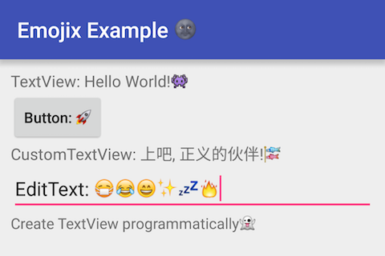

# Emojix
[](http://www.apache.org/licenses/LICENSE-2.0.html) [](https://jitpack.io/#nekocode/Emojix)

### Preview


### Using with gradle
- Add the JitPack repository to your root build.gradle:
```gradle
repositories {
    maven { url "https://jitpack.io" }
}
```

- Add the dependency to your sub build.gradle:
```gradle
dependencies {
    compile 'com.github.nekocode:Emojix:{lastest-version}'
}
```

### Usage

Just wrap the `Activity` Context:

```java
@Override
protected void attachBaseContext(Context newBase) {
    super.attachBaseContext(CalligraphyContextWrapper.wrap(newBase));
}
```

And everything is OK now! Anyway, you can apply these code to your `BaseActivity` for implementing emojis to the whole application.